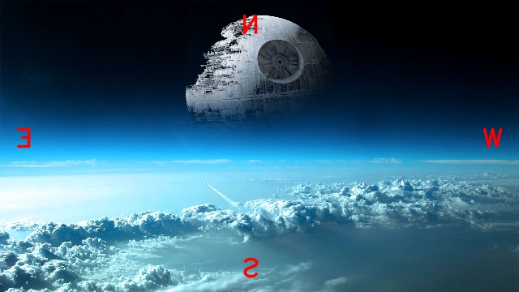
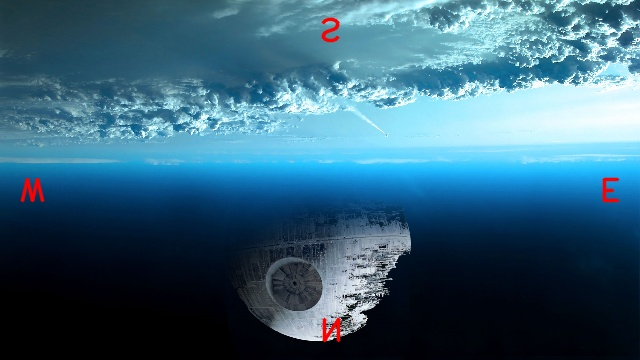

# 🖼️ GreenScreenFX – Manual Chroma Keying & Image Flipping in Pure Python

GreenScreenFX is a simple image processing tool built entirely with core Python. It performs two main functions: flipping an image horizontally or vertically, and removing green screen backgrounds using basic color distance logic. All transformations are implemented manually without external libraries like OpenCV or NumPy.

## 🔧 Features

- **Image Flipping**
  - Supports both horizontal and vertical flipping
  - Useful for visual transformations and orientation changes

- **Chroma Keying**
  - Detects and removes green pixels from a foreground image
  - Replaces them with corresponding pixels from a background image
  - Uses Euclidean distance to evaluate similarity to green

## 📂 Project Structure

```
GreenScreenFX/
├── processor/
│   └── image_ops.py           # Contains flip() and chroma_key() logic
├── output/
│   ├── flipped_horizontal.jpg
│   ├── flipped_vertical.jpg
│   ├── chroma_keyed.jpg
├── assets/
│   ├── compass.jpg            # Image for flipping demo
│   ├── falcon.png             # Foreground image with green screen
│   ├── dstar.png              # Background image
├── run_processor.py           # Command-line interface to run functions
└── README.md
```

## 🖥️ How It Works

### Image Flipping
A new image is generated by reversing rows or columns. Horizontal flip mirrors the image along the vertical axis; vertical flip mirrors it along the horizontal axis.

### Chroma Keying
Each pixel in the foreground image is compared to a target green value. If it's close enough (within a threshold), it's replaced by the corresponding pixel from the background image.

## 📸 Sample Output

### Image Flipping

| Original | Horizontal Flip | Vertical Flip |
|----------|------------------|----------------|
|  |  |  |

### Chroma Keying

| Foreground | Background | Result |
|------------|------------|--------|
|  |  |  |

## ▶️ Usage

```bash
# Run the default process
python run_processor.py

# Flip image vertically
python run_processor.py --flip vertical

# Run chroma keying with custom green and threshold
python run_processor.py --chroma --r 0 --g 200 --b 0 --threshold 150
```

## ✅ Built With

- Python 3
- No external image processing libraries
- Only standard modules like `math`, `argparse`, and `os`
